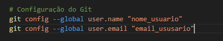

# Configurando o Ambiente usando Bash Script  

Aqui você encontrará scripts úteis para automação de tarefas no ambiente Linux. Este repositório é ideal para quem busca otimizar processos e configurar ambientes de forma prática e rápida.  

---

## 📜 Sobre o Repositório  

O repositório foi criado com o objetivo de centralizar scripts Bash que automatizam configurações e instalações no sistema Linux. Esses scripts são ideais para desenvolvedores, administradores de sistemas e entusiastas que desejam economizar tempo na configuração de suas máquinas.  

---

## 🛠️ **Script: Configuração de Ambiente Docker e Ferramentas Essenciais**  

Este script instala e configura as principais ferramentas de desenvolvimento, incluindo:  
- **Docker**: Configuração completa com criação de grupo e execução de imagem de teste.  
- **Java**: Instalação do JDK e JRE.  
- **Git**: Instalação e configuração do nome de usuário e email.  
- **Node.js**: Instalação da versão LTS via NVM.  
- **PHP e Apache2**: Instalação do servidor web com módulos PHP.  

### 🚀 **Como Usar o Script**  

1. Clone este repositório em sua máquina:  
   ```bash
   git clone https://github.com/emeps/bash-script.git
   cd bash-script
2. Tornando o script executável
    ```bash
    chmod +x init.sh
---
### Importante:
Antes de ir ao passo 3, abra o script com VSCode ou seu editor de preferência e **localize as linhas de comando do Git abaixo** e substitua **"nome_usuario"** e **"email_usuario"** com os seus dados antes de executar o script.


---

Feita as alterações, execute o passo 3

3. Executando script
    ```bash
    ./init.sh
4. Após a execução, ative as alterações no grupo Docker:  
   ```bash
   newgrp docker
   docker run hello-world
   ```  
## 📄 Licença  

Este projeto está licenciado sob a licença MIT. Consulte o arquivo [LICENSE](LICENSE) para obter mais detalhes.  